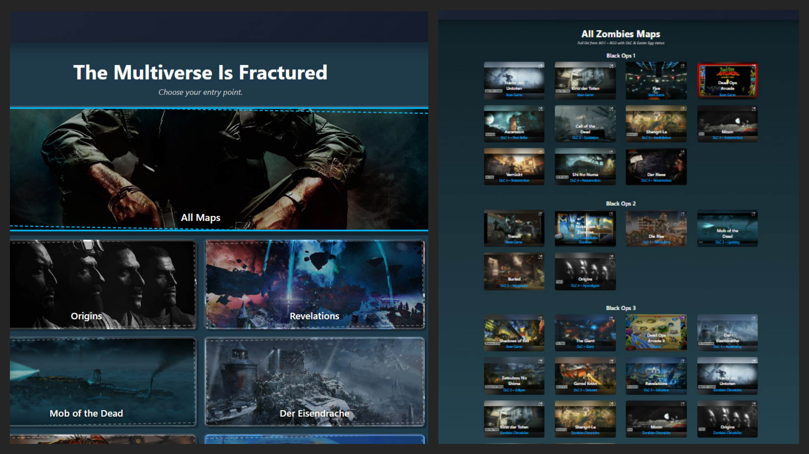

# Zombies Hub 2.0

👾 Welcome to **Zombies Hub 2.0** — the next generation of the Call of Duty Zombies companion hub. 👾

Zombies Hub 2.0 takes the original Zombies Hub and its separate map/Easter Egg guide sites and brings them together into **one unified React application** built to be faster, cleaner, easier to follow, and much easier to maintain.

The goal is simple:

> Give players the correct information they need, exactly when they need it, without making them dig through a wiki or wait for another website to load.

## 🧟 Original Zombies Hub

The original Hub is still available here:

[https://zombies-hub.onrender.com](https://zombies-hub.onrender.com)

The original repositories and deployments remain untouched while Zombies Hub 2.0 is built and verified.

## 📸 Original Hub Screenshot



## 🚀 What Makes Zombies Hub 2.0 Better?

The original Zombies Hub proved the concept. **2.0 turns it into one complete Zombies guide platform.**

| Original Zombies Hub | Zombies Hub 2.0 |
| --- | --- |
| Main Hub and dedicated guides lived on separate Render services | **One React app and one deployment** |
| Dedicated maps were loaded through external Render pages / iframes | **Dedicated maps load instantly as internal routes** |
| Separate services could take minutes to spin up | **No Render-to-Render waiting between guides** |
| Every guide had its own independent app shell | **One persistent global Zombies Hub shell** |
| Headers and layouts could overlap or feel disconnected | **Global Hub header + organized map-specific navigation** |
| Map projects used different routing, dependency versions, and global CSS | **Central routing with isolated map modules and scoped styling** |
| Guide presentation varied heavily between maps | **Shared guide language while preserving each map's personality** |
| Some maps relied heavily on videos, long text, or bare-bones pages | **Guide-first design focused on clear objectives and next steps** |
| Accuracy depended on the original individual guide | **Transcript-backed accuracy audits before a map is considered finished** |
| Side Easter Egg coverage was limited | **Responsive Side Easter Egg system with room for expansion** |
| No unified path for interactive practice tools | **Architecture supports future interactive guides, solvers, and speedrun trainers** |

## 🗺️ Hub Sections

- **Featured Maps**  
  Quick access to major guides and useful Zombies resources.

- **All Maps**  
  Browse the Black Ops 1–3 map collection with map imagery, DLC information, and Easter Egg status.

- **Easter Egg Maps**  
  Jump directly into maps with Main Easter Egg content.

- **Side Easter Eggs**  
  Smaller Easter Eggs, music Easter Eggs, hidden interactions, and map-specific extras.

## 🧭 Dedicated Map Guides

Zombies Hub 2.0 currently integrates these full guide applications directly into the Hub:

- **Origins**
- **Mob of the Dead**
- **Shadows of Evil**
- **Der Eisendrache**
- **Zetsubou No Shima**
- **Gorod Krovi**
- **Revelations**

They are no longer separate destinations. Each guide lives under the Hub through internal routes:

```text
/maps/origins
/maps/mob-of-the-dead
/maps/shadows-of-evil
/maps/der-eisendrache
/maps/zetsubou-no-shima
/maps/gorod-krovi
/maps/revelations
```

Dedicated-guide routing is centralized in `apps/hub/src/data/dedicatedGuides.js` so the Hub shell, map redirects, and legacy Easter Egg redirects all use the same source of truth.

## 🎯 Guide Philosophy

Every map should answer one question clearly:

> **What do I need to do next?**

The project uses a common guide language without forcing every map into the exact same design:

1. Map-specific header and local navigation
2. Main Easter Egg guide in actual run order
3. Short objective first, deeper detail on demand
4. Quick-reference images and puzzle diagrams
5. Videos and timestamps only when they make a step easier to understand
6. Map-specific tools and solvers where useful
7. Side Easter Eggs
8. Tips and speedrun references
9. Map-specific footer

The structure stays familiar across maps while the artwork, colors, backgrounds, and special tools preserve each map's identity.

### Current design references

- **Origins** is the usability and guide-structure standard: simple, direct, visual, and easy to scan.
- **Revelations** is the visual presentation standard: strong header/footer treatment, background integration, and cohesive map identity.

## ✅ Accuracy Matters

A polished page is useless if the Easter Egg information is wrong.

The main dedicated guides are being checked against full walkthrough transcripts for:

- Correct Easter Egg step order
- Prerequisites
- Missing steps
- Staff / weapon puzzle solutions
- Switch codes and orientations
- Player-count requirements
- Boss-fight requirements
- Rewards
- Side Easter Eggs
- Video timestamps

Major factual corrections already made in 2.0 include:

- **Origins** — corrected the Main Quest order, Rain Fire, Maxis Drone, Zombie Blood, fist upgrade, and final Crazy Place sequence.
- **Mob of the Dead** — replaced the old item-page structure with the actual Pop Goes the Weasel run from Warden's Key through the final Weasel showdown.
- **Shadows of Evil** — corrected the sword / Pack-a-Punch order, sword upgrade, flag sequence, Shadowman fight, and four-player train finale.
- **Der Eisendrache** — corrected the base bow, consolidated all four upgraded-bow paths, rebuilt the main quest flow, and separated the boss sequence into a usable fight sheet.
- **Zetsubou No Shima** — rebuilt the run around Trials, Skull, KT-4 / Masamune, three cogs, elevator, and Giant Thrasher progression.
- **Gorod Krovi** — converted the wiki-like page into an actionable run and corrected duplicated buildable data.
- **Revelations** — reverified the full run from the tombstones through Runes, Summoning Key throws, S.O.P.H.I.A., and the Shadowman finale.

The goal is for Zombies Hub to become something players can confidently keep open while they are actually running an Easter Egg.

## 🧩 Modular Architecture

Even though everything runs as one application, maps remain cleanly separated in the repository.

```text
Zombies-Hub-2.0/
├── apps/
│   └── hub/
├── maps/
│   ├── origins/
│   ├── mob-of-the-dead/
│   ├── shadows-of-evil/
│   ├── der-eisendrache/
│   ├── zetsubou-no-shima/
│   ├── gorod-krovi/
│   └── revelations/
├── shared/
└── docs/
```

Each dedicated map owns its pages, data, assets, local navigation, and styling. Shared UI exists only where reuse actually helps.

Map CSS is intentionally scoped under module roots such as:

- `.origins-module`
- `.mob-module`
- `.shadows-module`
- `.de-module`
- `.zets-module`
- `.gorod-module`
- `.revelations-module`

This replaces the accidental CSS isolation that the old iframe architecture provided and prevents one map from overriding the Hub or another guide.

## 🧪 Current Status

### Core migration — complete

- Original Hub migrated into 2.0
- Dedicated guide repositories copied into organized map modules
- One React root
- One React Router setup
- Dedicated guides mounted as internal routes
- External dedicated-map iframe behavior removed
- Legacy Render map links converted to internal routes
- Central dedicated-guide registry added
- Per-map CSS isolation added
- Automated GitHub production build checks added

### Guide overhaul — major pass complete

- **Origins** — flat-guide presentation preserved; main run corrected; header/navigation polished
- **Mob of the Dead** — factual run rebuilt; navigation reorganized; footer/header isolated
- **Shadows of Evil** — full dedicated guide created and transcript verified
- **Der Eisendrache** — complete guide/bow/gear/wisp/boss overhaul
- **Zetsubou No Shima** — run-first main guide and deep-reference pages rebuilt
- **Gorod Krovi** — run-first conversion, Valve Solver, trophies/challenges, boss and buildables cleanup
- **Revelations** — persistent timestamp player, main-run verification, Sound Step labels, header/footer and CSS isolation
- **Side Easter Eggs** — responsive sizing and CSS collisions corrected

### Current phase — browser QA + remaining content depth

Priority work now includes:

- Real-browser visual QA at desktop, tablet, and mobile widths
- Remaining per-map spacing / overflow cleanup found during QA
- Final Lightning Staff switch imagery and quick-reference popup verification
- Side Easter Egg and music Easter Egg expansion using verified sources
- Metadata / lore / release-date audit for the non-dedicated maps
- Final video-link and timestamp spot checks
- Deployment smoke testing before calling 2.0 production-ready

## ⚡ Future: Interactive Guides & Speedrun Training

Once the static guides are fully verified and stable, Zombies Hub 2.0 is designed to support interactive practice tools.

Origins is planned as the first test map. The roadmap includes:

- Interactive Easter Egg / speedrun practice
- Wind Staff ring puzzle simulation
- Ice Staff symbol-matching practice
- Lightning Staff switch practice
- Fire Staff memory exercises
- Correct / incorrect feedback
- Optional sound and animation
- Timed practice and local personal bests
- Test mode that hides answers until requested

The static Origins guide will always remain available — interactive tools supplement it rather than replace it.

See [`docs/origins-interactive-roadmap.md`](docs/origins-interactive-roadmap.md) for the full concept.

## 💻 Local Development

```bash
npm install
npm run dev
```

Production build:

```bash
npm run build
```

## 📚 Project Documentation

- [`docs/architecture.md`](docs/architecture.md) — application architecture
- [`docs/migration-inventory.md`](docs/migration-inventory.md) — migration/audit notes
- [`docs/polish-roadmap.md`](docs/polish-roadmap.md) — accuracy and polish roadmap
- [`docs/origins-interactive-roadmap.md`](docs/origins-interactive-roadmap.md) — future Origins interactive / speedrun system

---

🧟 **Zombies Hub 2.0 is being built to be more than a collection of Zombies pages — the goal is one fast, accurate, professional guide system players can actually rely on.**
